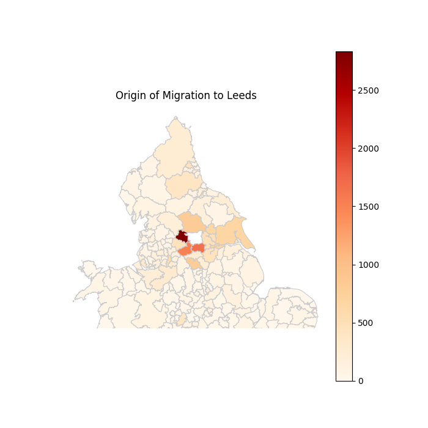
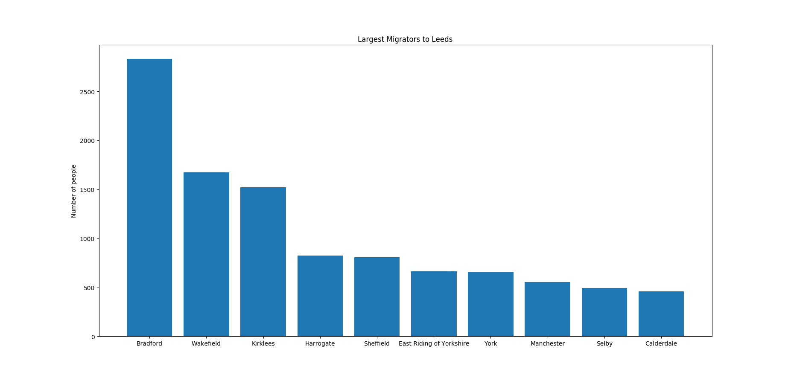
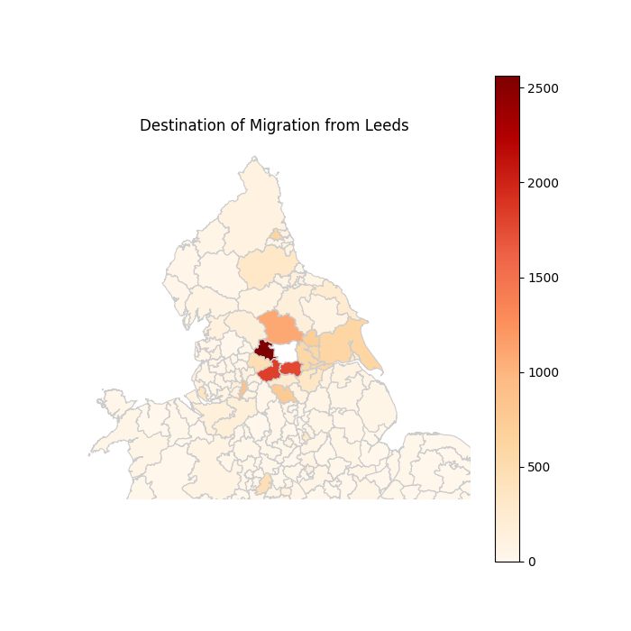
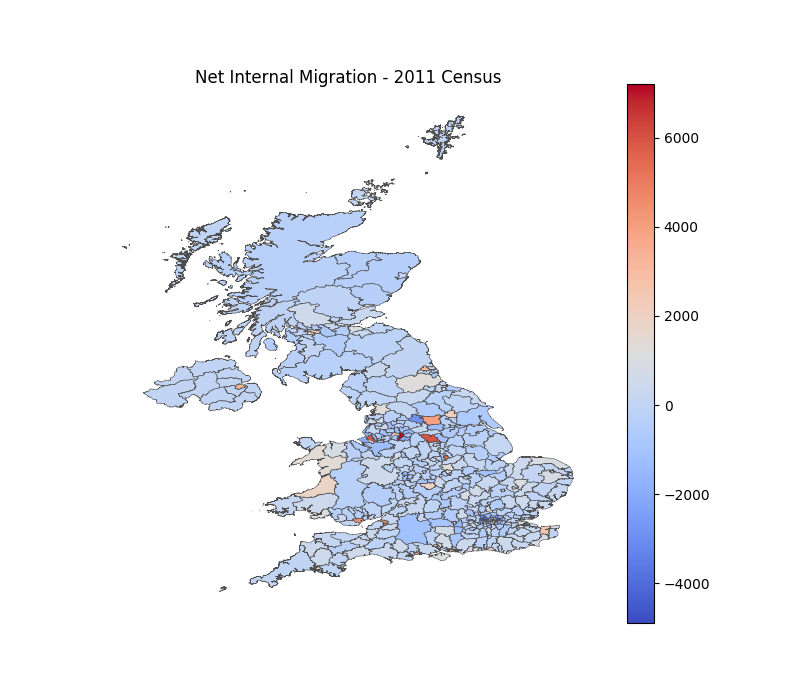
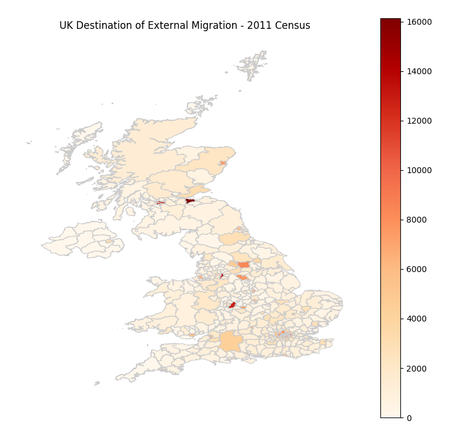

# Migration

TO DO:
- display flows (to and from each region?)
- migration leaving the UK (+net external)
- reason for migration
- origin of external migration (how do different areas of the world compare)

Internal and external migration in the UK.    
For the purpose of this work, internal migration is considered as that originating and ending within the UK.    
External is that originating from countries outside the UK.

Migration data obtained from 2011 [Census](https://www.nomisweb.co.uk/census/2011/origin_destination).            
Shapefiles obtained from the Office for National Statistics [geoportal](http://geoportal1-ons.opendata.arcgis.com/datasets/fab4feab211c4899b602ecfbfbc420a3_2).

The data used displays the changes in residence from one year to the next. It is displayed in Local Authority Districts (LADs as of 2011).

The previous place of residence of 2011 internal migration to Leeds is shown in figures 1 & 2. Most internal migrants lived in LADs within Yorkshire in the year prior to moving to Leeds. Approximately 69% of Leeds residents already resided in Leeds the previous year. The remaining movement mainly originates from large cities in the UK such as Sheffield and Manchester.

     
**Figure 1.** Origin of Migration to Leeds. Most migration to Leeds originates from  Yorkshire, although there is some movement from large cities such as Sheffield. The value for residents remaining in Leeds has been set to zero for clarity.

    
**Figure 2.** Top 10 origins of migration to Leeds.        

The destination distribution of migration originating from Leeds (figure 3) is quite similar to the origin distribution seen in figure 1. The main differences are caused by a larger migration towards big cities, with slight increases to all major cities (Manchester, Birmingham, Newcastle, Nottingham ...). 

    
**Figure 3.** Destination of Migration Originating from Leeds. The destination of migration from Leeds looks quite similar to the distribution seen in figure one.   

Having data for migration entering and leaving each city, the net internal migration for the UK can be calculated. This is displayed in figure 4. As expected, large cities such as Manchester are strong attractors of migration. This is also true for the capitals of Wales (Cardiff) and Northern Ireland (Belfast). However, London has a strongly negative internal migration, with many people leaving London towards other cities across the UK.

    
**Figure 4.** Net Internal Migration in the UK. In general, net migration is positive for big cities such as Manchester, as well as the capitals of Wales (Cardiff) and Northern Ireland (Belfast). It is interesting to note that London has a strongly negative net internal migration, perhaps due to a positive external migration which then moves internally across the UK.    

The scale of migration entering the UK from the rest of the world is quite large compared to internal migration. Most of this having large cities as the destination, this can be seen in figure 5. The key difference between internal and external migration is that London is a major destination for overseas migration. This migration to London is much larger than that leaving London internally. This results in a net positive population change for London. It seems like London attracts external migration as a first destination in the UK, and then this spreads towards other locations within the UK. 

        
**Figure 5.** External Migration to the UK. Similar to internal migration, big cities attract external migration. The key difference is that London is a major destination for external migration.     
