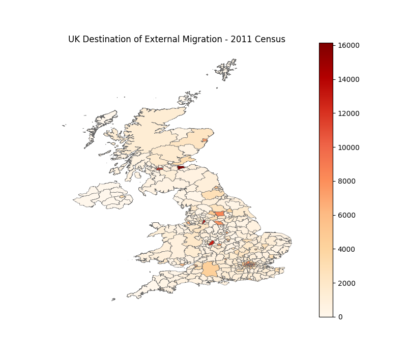

# Migration

Internal and external migration in the UK.

Migration data obtained from 2011 [Census](https://www.nomisweb.co.uk/census/2011/origin_destination).            
Shapefiles obtained from the Office for National Statistics [geoportal](http://geoportal1-ons.opendata.arcgis.com/datasets/fab4feab211c4899b602ecfbfbc420a3_2).

The data used displays the changes in residence from one year to the next.
     
     
**Figure 1.** Origin of Migration to Leeds. Most migration to Leeds originates from  Yorkshire, although there is some movement from large cities such as Manchester.        
    
**Figure 2.** Top 10 origins of migration to Leeds.         
    
**Figure 3.** Destination of Migration Originating from Leeds. The destination of migration from Leeds looks quite similar to the distribution seen in figure one.    
    
**Figure 4.** Net Internal Migration in the UK. In general, net migration is positive for big cities such as Manchester, as well as the capitals of Wales (Cardiff) and Northern Ireland (Belfast). It is interesting to note that London has a strongly negative net internal migration, perhaps due to a positive external migration which then moves internally across the UK.    
        
**Figure 5.** External Migration to the UK.     
