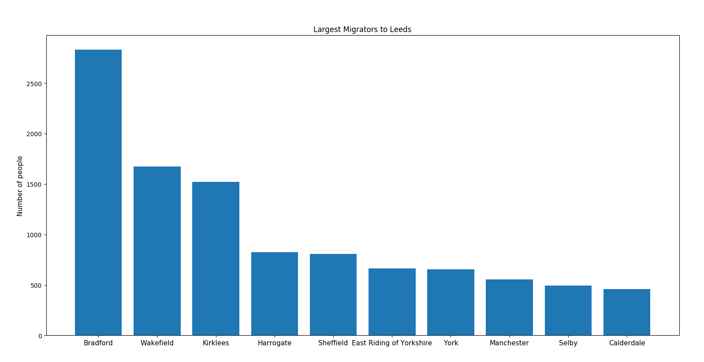

# Migration

Internal migration in the UK.

Migration data obtained from 2011 [Census](https://www.nomisweb.co.uk/census/2011/origin_destination).            
Shapefiles obtained from the Office for National Statistics [geoportal](http://geoportal1-ons.opendata.arcgis.com/datasets/fab4feab211c4899b602ecfbfbc420a3_2).

